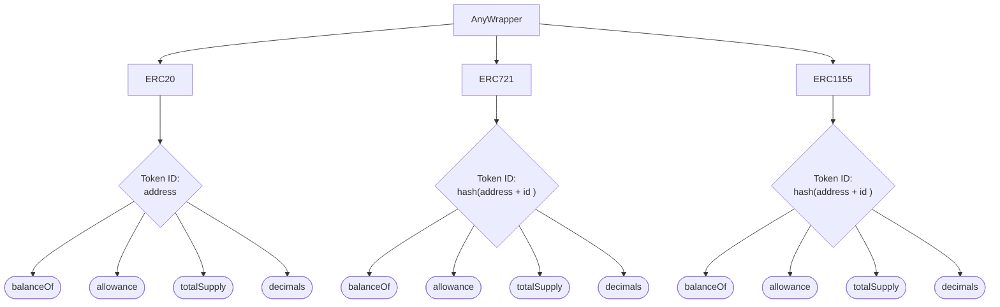
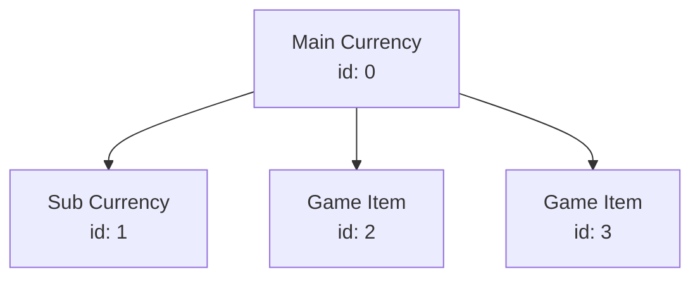
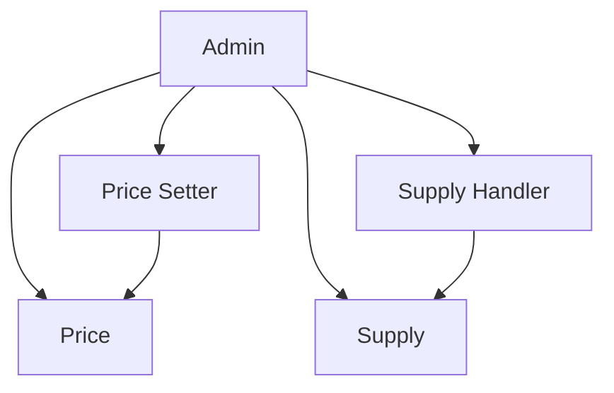

# Example Implementations For ERC-6909

## [Any Wrapper](src/AnyWrapper.sol)

Wraps ERC-20, ERC-721, and ERC-1155 tokens under a single unified contract.

## [In Game Items](src/InGameItems.sol)

Maintains multiple fungible and non-fungible game assets at fixed swap rates.

### Item / Currency Heirarchy

### Admin System

